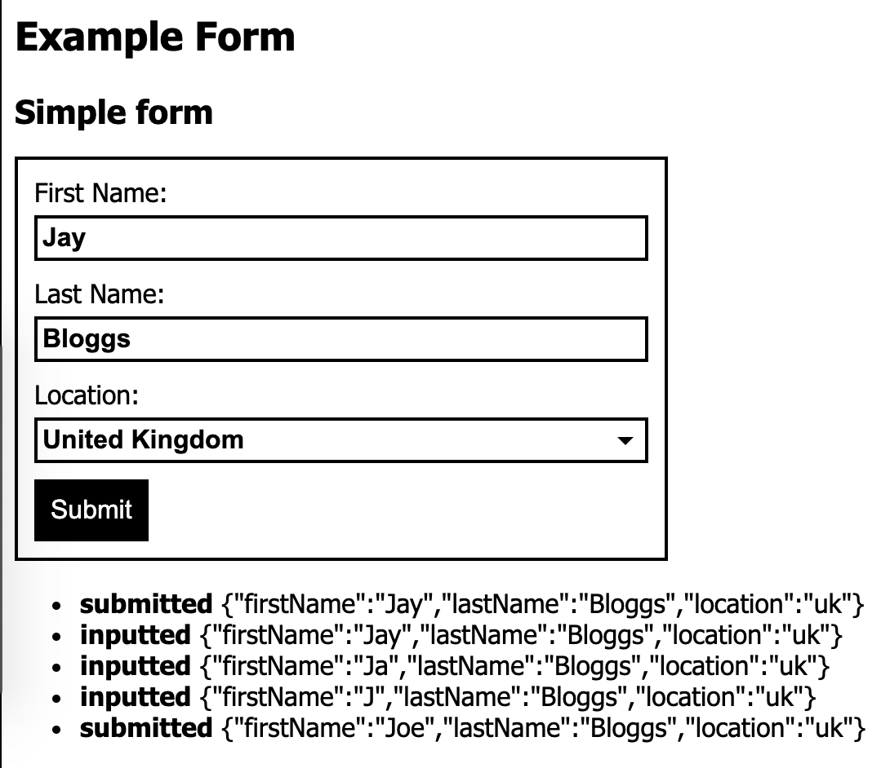

# toc-form
This is a component that can be used in any UI library that uses a (tagName, options, children) function signature.

[Live demo](https://minthril-demo.onrender.com/)

## Screenshot


## Example Usage
```javascript
h(
  'div',
  { class: 'someForm' },
  createForm(minthril, {
    fields: [{
      name: 'firstName',
      label: 'First Name',
      component: formFieldText,
      autoFocus: true,
      initialValue: 'Joe'
    }, {
      name: 'lastName',
      label: 'Last Name',
      component: formFieldText,
      initialValue: 'Bloggs'
    }
  )
)
```